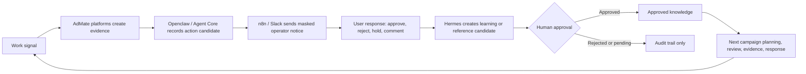

# AdMate Knowledge Operations Infographic Brief

Updated: 2026-06-28

Purpose: one/two-page source brief for a simple infographic that explains how Hermes, Openclaw, n8n/Slack, AdMate platforms, DAT Workflow, and AI Venture Lab connect. This is a concept/operating-model brief, not a claim that every future connection is already implemented.

## Page 1. The Simple Story

**Core message**

AdMate does not just answer or automate. It preserves the reason behind a decision, routes human approval, and turns approved operational lessons into reusable knowledge.

### What each part does

1. **DAT Workflow**
   - Collects team mail and work requests.
   - Normalizes work type, owner, difficulty, issue, and reference-candidate signals.
   - Output is not knowledge yet. It is structured work context.

2. **Compass / Sentinel / Lens / Foresight**
   - Compass finds policy, product, and review-guide grounds.
   - Sentinel finds setup risks and live operational signals.
   - Lens creates visual evidence for review and reporting.
   - Foresight provides benchmark and forecast ranges for planning.

3. **Openclaw / Agent Core**
   - Converts signals into action candidates.
   - Tracks execution request, permission, approval, delivery state, and audit trail.
   - Does not present risky changes as automatic execution.

4. **n8n / Slack**
   - Sends masked operator notifications or action prompts.
   - Slack is an operator surface, not the source of truth.
   - Webhook/channel/user details must remain masked in presentation assets.

5. **Hermes**
   - Receives user reactions and operational outcomes as candidates.
   - Separates `learning candidate`, `reference candidate`, rejected item, and approved knowledge.
   - Only approved knowledge can be reused in later answers or operations.

6. **AI Venture Lab**
   - Uses approved operational knowledge and future AI-news signals as idea inputs.
   - Scores business value, risk, and feasibility.
   - Promotes strong ideas into PRD/MVP experiments and future platform candidates.

## Page 2. Depth View

| Layer | Input | Processing | Output | Approval boundary |
| --- | --- | --- | --- | --- |
| Team work intake | Mail, requests, campaign issues | DAT Workflow classifies work and reference candidates | Structured task context | Team/operator review |
| Platform evidence | Policy questions, setup checks, capture needs, forecast needs | Compass, Sentinel, Lens, Foresight create evidence or review ranges | Source, risk, image, forecast basis | Product-specific safety rules |
| Action routing | Risk signal or action candidate | Openclaw / Agent Core records candidate and delivery status | Audit event, Slack/n8n notice, operator action candidate | Human operator |
| User response | Approve, reject, hold, comment, reference mark | Hermes separates feedback into candidates | Learning/reference candidate | Human approval before knowledge |
| Knowledge reuse | Approved operating criteria | Hermes-approved knowledge becomes reusable context | Better future planning, review, response | Commander/product governance |
| Venture discovery | Approved knowledge + future AI-news signal | AI Venture Lab evaluates business potential | Idea score, PRD/MVP candidate | Separate product approval |

## Visual Rules

- Show approved knowledge as a locked/verified node.
- Show learning candidate as a waiting-room node, not as stored truth.
- Show Slack/n8n as a delivery channel, not as the source of record.
- Show Openclaw as orchestration and audit, not a free-running automation bot.
- Show DAT Workflow and AI Venture Lab as adjacent systems, not core AdMate production modules.
- Mark AI-news collection as future/planned input.

## Safe Presentation Language

Use:

- "조치 후보"
- "검토 기준"
- "근거 보존"
- "사용자 반응"
- "learning candidate"
- "approved knowledge"
- "future/planned input"

Avoid:

- "자동 학습"
- "자동 집행"
- "확정 정답"
- "성과 보장"
- "Slack이 직접 판단"
- "미승인 데이터가 곧바로 운영 지식이 됨"

## Suggested One-page Layout

Top: one sentence value proposition.

Middle: left-to-right loop:

`DAT Workflow / work signal -> AdMate platforms -> Openclaw + n8n/Slack -> user response -> Hermes approval -> approved knowledge -> next operation`

Bottom: AI Venture Lab side branch:

`approved knowledge + future AI-news signal -> idea score -> PRD/MVP -> future platform candidate`

Footer: approval boundary note:

"승인 전 반응은 후보이고, 승인된 기준만 운영 지식으로 재사용한다."
